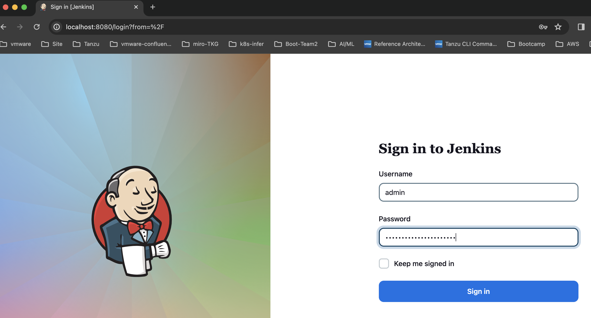
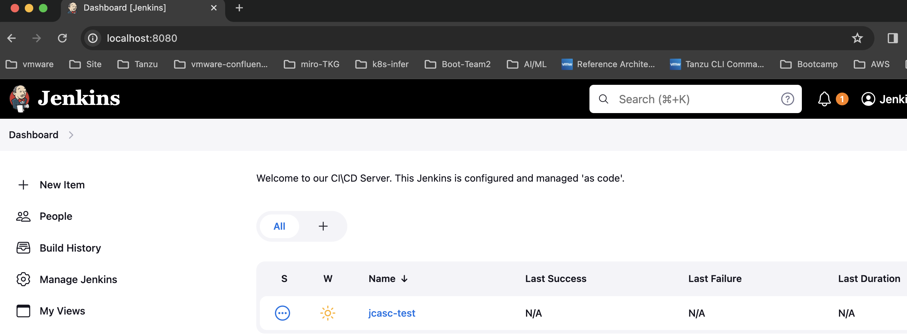
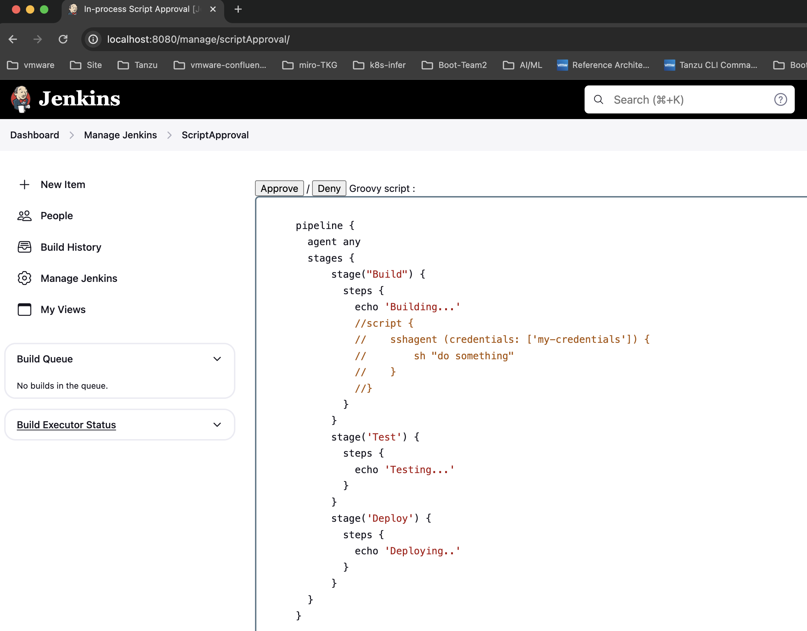
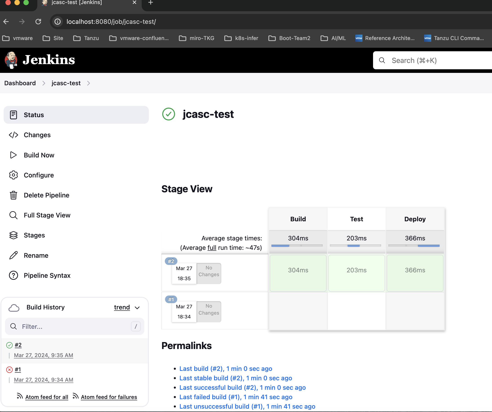
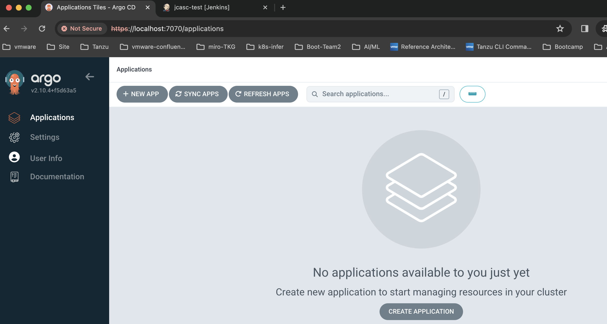

# Deploy DevOps Tool Chain on Kind Cluster with Terraform

## Creating a kind cluster

To install kind you can follow the official docs:
https://kind.sigs.k8s.io/docs/user/quick-start


## Install Terraform CLI
To install terraform CLI, you can use this docs:
https://developer.hashicorp.com/terraform/tutorials/aws-get-started/install-cli

## Install Kubectl CLI
https://kubernetes.io/ko/docs/tasks/tools/


## After Clone the Repo, Please Run Terraform as follows.
```bash
$ terraform init

Initializing the backend...

Initializing provider plugins...
- Finding tehcyx/kind versions matching "0.2.0"...
- Finding hashicorp/kubernetes versions matching "2.22.0"...
- Finding hashicorp/helm versions matching "2.10.1"...
- Finding hashicorp/null versions matching "3.2.1"...
- Installing hashicorp/null v3.2.1...
- Installed hashicorp/null v3.2.1 (signed by HashiCorp)
- Installing tehcyx/kind v0.2.0...
- Installed tehcyx/kind v0.2.0 (self-signed, key ID 15BD4444F5DB9E44)
- Installing hashicorp/kubernetes v2.22.0...
- Installed hashicorp/kubernetes v2.22.0 (signed by HashiCorp)
- Installing hashicorp/helm v2.10.1...
- Installed hashicorp/helm v2.10.1 (signed by HashiCorp)

Partner and community providers are signed by their developers.
If you'd like to know more about provider signing, you can read about it here:
https://www.terraform.io/docs/cli/plugins/signing.html

Terraform has created a lock file .terraform.lock.hcl to record the provider
selections it made above. Include this file in your version control repository
so that Terraform can guarantee to make the same selections by default when
you run "terraform init" in the future.

Terraform has been successfully initialized!
....
commands will detect it and remind you to do so if necessary.
```

```bash
$ terraform apply -auto-approve
Terraform used the selected providers to generate the following execution plan. Resource actions are indicated with the following symbols:
  + create

Terraform will perform the following actions:

  # helm_release.ingress_nginx will be created
  + resource "helm_release" "ingress_nginx" {
      + atomic                     = false
      + chart                      = "ingress-nginx"
      + cleanup_on_fail            = false
      + create_namespace           = true
      + dependency_update          = false
      + disable_crd_hooks          = false
      + disable_openapi_validation = false
      + disable_webhooks           = false
      + force_update               = false
      + id                         = (known after apply)
      + lint                       = false
      + manifest                   = (known after apply)
      + max_history                = 0
      + metadata                   = (known after apply)
      + name                       = "ingress-nginx"
      + namespace                  = "ingress-nginx"
      + pass_credentials           = false
      + recreate_pods              = false
      + render_subchart_notes      = true
      + replace                    = false
      + repository                 = "https://kubernetes.github.io/ingress-nginx"
      + reset_values               = false
      + reuse_values               = false
      + skip_crds                  = false
      + status                     = "deployed"
      + timeout                    = 300
      + values                     = [
.....
.....
helm_release.jenkins: Still creating... [30s elapsed]
helm_release.jenkins: Still creating... [40s elapsed]
helm_release.jenkins: Still creating... [50s elapsed]
helm_release.jenkins: Still creating... [1m0s elapsed]
helm_release.jenkins: Still creating... [1m10s elapsed]
helm_release.jenkins: Still creating... [1m20s elapsed]
helm_release.jenkins: Still creating... [1m30s elapsed]
helm_release.jenkins: Still creating... [1m40s elapsed]
helm_release.jenkins: Still creating... [1m50s elapsed]
helm_release.jenkins: Still creating... [2m0s elapsed]
helm_release.jenkins: Still creating... [2m10s elapsed]
helm_release.jenkins: Still creating... [2m20s elapsed]
helm_release.jenkins: Creation complete after 2m24s [id=jenkins]

Apply complete! Resources: 7 added, 0 changed, 0 destroyed.
```

```bash
$ terraform state list
terraform state list
helm_release.ingress_nginx
helm_release.jenkins
helm_release.metallb
kind_cluster.default
null_resource.wait_for_ArgoCD
null_resource.wait_for_ingress_nginx
null_resource.wait_for_metallb
```

```bash
$ kind get clusters
kind-devops-tool

$ docker ps -a | grep kind-devops-tool
c8542449b8b0   kindest/node:v1.27.3   "/usr/local/bin/entr…"   19 minutes ago   Up 18 minutes                 0.0.0.0:80->80/tcp, 0.0.0.0:443->443/tcp, 127.0.0.1:59173->6443/tcp   kind-devops-tool-control-plane
8a23ec2cfd51   kindest/node:v1.27.3   "/usr/local/bin/entr…"   19 minutes ago   Up 18 minutes  

$ kubectl get po -A -o wide
NAMESPACE            NAME                                                     READY   STATUS    RESTARTS   AGE   IP            NODE                             NOMINATED NODE   READINESS GATES
argocd               argocd-application-controller-0                          1/1     Running   0          14m   10.244.1.12   kind-devops-tool-worker          <none>           <none>
argocd               argocd-applicationset-controller-7b9c4dfb77-vrqh9        1/1     Running   0          14m   10.244.1.7    kind-devops-tool-worker          <none>           <none>
argocd               argocd-dex-server-9b5c6dccd-6zwsk                        1/1     Running   0          14m   10.244.1.6    kind-devops-tool-worker          <none>           <none>
argocd               argocd-notifications-controller-756764ddd5-srpqz         1/1     Running   0          14m   10.244.1.8    kind-devops-tool-worker          <none>           <none>
argocd               argocd-redis-69f8795dbd-lg4v8                            1/1     Running   0          14m   10.244.1.9    kind-devops-tool-worker          <none>           <none>
argocd               argocd-repo-server-565fb47c89-2lwck                      1/1     Running   0          14m   10.244.1.10   kind-devops-tool-worker          <none>           <none>
argocd               argocd-server-86f64667bc-t8kgw                           1/1     Running   0          14m   10.244.1.11   kind-devops-tool-worker          <none>           <none>
ingress-nginx        ingress-nginx-controller-6b9d98676-xsn8k                 1/1     Running   0          15m   10.244.0.5    kind-devops-tool-control-plane   <none>           <none>
jenkins              jenkins-0                                                2/2     Running   0          14m   10.244.1.13   kind-devops-tool-worker          <none>           <none>
kube-system          coredns-5d78c9869d-ppdj5                                 1/1     Running   0          16m   10.244.0.3    kind-devops-tool-control-plane   <none>           <none>
kube-system          coredns-5d78c9869d-rdnxw                                 1/1     Running   0          16m   10.244.0.4    kind-devops-tool-control-plane   <none>           <none>
kube-system          etcd-kind-devops-tool-control-plane                      1/1     Running   0          16m   172.18.0.3    kind-devops-tool-control-plane   <none>           <none>
kube-system          kindnet-7zrw5                                            1/1     Running   0          16m   172.18.0.2    kind-devops-tool-worker          <none>           <none>
kube-system          kindnet-fzxcr                                            1/1     Running   0          16m   172.18.0.3    kind-devops-tool-control-plane   <none>           <none>
kube-system          kube-apiserver-kind-devops-tool-control-plane            1/1     Running   0          16m   172.18.0.3    kind-devops-tool-control-plane   <none>           <none>
kube-system          kube-controller-manager-kind-devops-tool-control-plane   1/1     Running   0          16m   172.18.0.3    kind-devops-tool-control-plane   <none>           <none>
kube-system          kube-proxy-ch8w9                                         1/1     Running   0          16m   172.18.0.2    kind-devops-tool-worker          <none>           <none>
kube-system          kube-proxy-pwckm                                         1/1     Running   0          16m   172.18.0.3    kind-devops-tool-control-plane   <none>           <none>
kube-system          kube-scheduler-kind-devops-tool-control-plane            1/1     Running   0          16m   172.18.0.3    kind-devops-tool-control-plane   <none>           <none>
local-path-storage   local-path-provisioner-6bc4bddd6b-mrpz9                  1/1     Running   0          16m   10.244.0.2    kind-devops-tool-control-plane   <none>           <none>
metallb-system       metallb-controller-86dcf9f78c-vm4fv                      1/1     Running   0          16m   10.244.1.2    kind-devops-tool-worker          <none>           <none>
metallb-system       metallb-speaker-gcdch                                    4/4     Running   0          16m   172.18.0.2    kind-devops-tool-worker          <none>           <none>
metallb-system       metallb-speaker-qftml                                    4/4     Running   0          16m   172.18.0.3    kind-devops-tool-control-plane   <none>           <none>

$ kubectl get svc -A
NAMESPACE        NAME                                      TYPE           CLUSTER-IP      EXTERNAL-IP      PORT(S)                      AGE
argocd           argocd-applicationset-controller          ClusterIP      10.96.8.137     <none>           7000/TCP,8080/TCP            15m
argocd           argocd-dex-server                         ClusterIP      10.96.187.152   <none>           5556/TCP,5557/TCP,5558/TCP   15m
argocd           argocd-metrics                            ClusterIP      10.96.42.111    <none>           8082/TCP                     15m
argocd           argocd-notifications-controller-metrics   ClusterIP      10.96.86.196    <none>           9001/TCP                     15m
argocd           argocd-redis                              ClusterIP      10.96.167.171   <none>           6379/TCP                     15m
argocd           argocd-repo-server                        ClusterIP      10.96.169.195   <none>           8081/TCP,8084/TCP            15m
argocd           argocd-server                             ClusterIP      10.96.45.59     <none>           80/TCP,443/TCP               15m
argocd           argocd-server-metrics                     ClusterIP      10.96.192.117   <none>           8083/TCP                     15m
default          kubernetes                                ClusterIP      10.96.0.1       <none>           443/TCP                      17m
ingress-nginx    ingress-nginx-controller                  LoadBalancer   10.96.243.176   172.18.255.150   80:31790/TCP,443:30143/TCP   15m
ingress-nginx    ingress-nginx-controller-admission        ClusterIP      10.96.51.209    <none>           443/TCP                      15m
jenkins          jenkins                                   ClusterIP      10.96.215.133   <none>           8080/TCP                     15m
jenkins          jenkins-agent                             ClusterIP      10.96.182.241   <none>           50000/TCP                    15m
kube-system      kube-dns                                  ClusterIP      10.96.0.10      <none>           53/UDP,53/TCP,9153/TCP       17m
metallb-system   metallb-webhook-service                   ClusterIP      10.96.58.208    <none>           443/TCP                      17m
```                                                                         

```bash
## To access jenkins UI using port-forwarding
$ kubectl port-forward service/jenkins 8080:8080 -n jenkins
Forwarding from 127.0.0.1:8080 -> 8080
Forwarding from [::1]:8080 -> 8080

## To find jenkins UI password
$ kubectl get secret jenkins -n jenkins -o yaml -o jsonpath='{.data.jenkins-admin-password}' | base64 -d
vRP7GWycQjdNYx7th2139K
```
## Login Jenkins UI
  

## Perform automatically created Sample Pipeline using JCasC when deploying Jenkins    


   

```
Note)
When you run the sample pipeline named jcasc-test for the first time, an error occurs due to a security issue. 
To resolve this, you must perform a separate approve task in Jenkins as above.
```

```bash
## To access ArgoCD UI using port-forwarding
$ kubectl port-forward service/argocd-server 7070:80 -n argocd
Forwarding from 127.0.0.1:7070 -> 8080
Forwarding from [::1]:7070 -> 8080

## To find argocd UI password
$ kubectl get secret argocd-initial-admin-secret -n argocd -o yaml -o jsonpath='{.data.password}' | base64 -d
MlJzN3g1tluSsGUT
```
## Login Argocd UI
  

```bash
$ terraform destroy --auto-approve
kind_cluster.default: Refreshing state... [id=kind-devops-tool-]
helm_release.metallb: Refreshing state... [id=metallb]
null_resource.wait_for_metallb: Refreshing state... [id=866577744969338017]
helm_release.ingress_nginx: Refreshing state... [id=ingress-nginx]
null_resource.wait_for_ingress_nginx: Refreshing state... [id=8522452483008125928]
null_resource.wait_for_ArgoCD: Refreshing state... [id=2707189495627791940]
helm_release.jenkins: Refreshing state... [id=jenkins]

Terraform used the selected providers to generate the following execution plan. Resource actions are indicated with the following symbols:
  - destroy

Terraform will perform the following actions:

  # helm_release.ingress_nginx will be destroyed
  - resource "helm_release" "ingress_nginx" {
      - atomic                     = false -> null
      - chart                      = "ingress-nginx" -> null
      - cleanup_on_fail            = false -> null
      - create_namespace           = true -> null
      - dependency_update          = false -> null
      - disable_crd_hooks          = false -> null
      - disable_openapi_validation = false -> null
      - disable_webhooks           = false -> null
      - force_update               = false -> null
      - id                         = "ingress-nginx" -> null
      - lint                       = false -> null
      - max_history                = 0 -> null
      - metadata                   = [
....
....
Plan: 0 to add, 0 to change, 7 to destroy.
null_resource.wait_for_ArgoCD: Destroying... [id=2707189495627791940]
null_resource.wait_for_metallb: Destroying... [id=866577744969338017]
null_resource.wait_for_ingress_nginx: Destroying... [id=8522452483008125928]
null_resource.wait_for_metallb: Destruction complete after 0s
helm_release.jenkins: Destroying... [id=jenkins]
null_resource.wait_for_ArgoCD: Destruction complete after 0s
null_resource.wait_for_ingress_nginx: Destruction complete after 0s
helm_release.jenkins: Destruction complete after 3s
helm_release.ingress_nginx: Destroying... [id=ingress-nginx]
helm_release.ingress_nginx: Destruction complete after 0s
helm_release.metallb: Destroying... [id=metallb]
helm_release.metallb: Destruction complete after 1s
kind_cluster.default: Destroying... [id=kind-devops-tool-]
kind_cluster.default: Destruction complete after 6s

Destroy complete! Resources: 7 destroyed.
```

### Note1) In this way, the Tool Chain related to Cloud Native can be deployed through terraform by additional settings.
### Note2) Worker nodes in a kind cluster can be expanded by adding nodes in kind_cluster.tf file